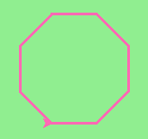

Chapter 5 Exercises
===================

**Question 1:** Use the ``draw_square`` function we wrote in this chapter to draw the image shown below. Assume each side is 20 units.
   
(Hint: notice that the turtle has already moved away from the ending point of the last square when the program ends.)

.. image:: _static/images/five_squares.png
..

    .. raw:: html

        <iframe height="400px" width="100%" src="https://repl.it/@launchcode/Demo-Ch-5-Exercise-1?lite=true" scrolling="no" frameborder="no" allowtransparency="true" allowfullscreen="true" sandbox="allow-forms allow-pointer-lock allow-popups allow-same-origin allow-scripts allow-modals"></iframe>

**Question 2:** Write a program to draw this. Assume the innermost square is 20 units per side and each successive square is 20 units bigger, per side, than the one inside it.

.. image:: _static/images/nested_squares.png
..

    .. raw:: html

        <iframe height="400px" width="100%" src="https://repl.it/@launchcode/Demo-Blank-Repl?lite=true" scrolling="no" frameborder="no" allowtransparency="true" allowfullscreen="true" sandbox="allow-forms allow-pointer-lock allow-popups allow-same-origin allow-scripts allow-modals"></iframe>

**Question 3:** Write a non-fruitful function ``draw_poly(t, sides, side_length)`` which makes a turtle draw a regular polygon. When called with ``draw_poly(tess, 8, 50)``, it will draw a shape like this:

..

    .. raw:: html

        <iframe height="400px" width="100%" src="https://repl.it/@launchcode/Demo-Blank-Repl?lite=true" scrolling="no" frameborder="no" allowtransparency="true" allowfullscreen="true" sandbox="allow-forms allow-pointer-lock allow-popups allow-same-origin allow-scripts allow-modals"></iframe>

**Question 4:** The two spirals in this picture differ only by the turn angle. Draw both.

*Note:* Because this program might receive a ``TimeLimitError`` we've added some code to our answer to make the turtle go faster (use its ``speed`` method) and to increase the time the program is allowed to run to 35 seconds. You can do the latter in your code using:

.. sourcecode:: python

    import sys
    sys.setExecutionLimit(35000)

.. image:: _static/images/tess_spirals.png
    :height: 240
..

    .. raw:: html

        <iframe height="400px" width="100%" src="https://repl.it/@launchcode/Demo-Blank-Repl?lite=true" scrolling="no" frameborder="no" allowtransparency="true" allowfullscreen="true" sandbox="allow-forms allow-pointer-lock allow-popups allow-same-origin allow-scripts allow-modals"></iframe>

**Question 5:** Write a non-fruitful function ``draw_equi_triangle(turtle, size)`` which calls ``draw_poly`` from the question above to have its turtle draw an equilateral triangle.

    .. raw:: html

        <iframe height="400px" width="100%" src="https://repl.it/@launchcode/Demo-Blank-Repl?lite=true" scrolling="no" frameborder="no" allowtransparency="true" allowfullscreen="true" sandbox="allow-forms allow-pointer-lock allow-popups allow-same-origin allow-scripts allow-modals"></iframe>

**Question 6:** Write a fruitful function ``sum_to(n)`` that returns the sum of all integer numbers up to and including ``n``.  So ``sum_to(10)`` would be ``1+2+3...+10`` which would return the value 55. Use the equation  (n * (n + 1)) / 2.

    .. raw:: html

        <iframe height="400px" width="100%" src="https://repl.it/@launchcode/Demo-Ch-5-Exercise-6?lite=true" scrolling="no" frameborder="no" allowtransparency="true" allowfullscreen="true" sandbox="allow-forms allow-pointer-lock allow-popups allow-same-origin allow-scripts allow-modals"></iframe>

**Question 7:** Write a non-fruitful function to draw a five pointed star, where the length of each side is 100 units.

.. image:: _static/images/star.png
.. 

    .. raw:: html

        <iframe height="400px" width="100%" src="https://repl.it/@launchcode/Demo-Blank-Repl?lite=true" scrolling="no" frameborder="no" allowtransparency="true" allowfullscreen="true" sandbox="allow-forms allow-pointer-lock allow-popups allow-same-origin allow-scripts allow-modals"></iframe>

**Question 8:** Extend your program above. Draw five stars, but between each, pick up the pen, move forward by 350 units, turn right by 144, put the pen down, and draw the next star. You'll get something like this (note that you will need to move to the left before drawing your first star in order to fit everything in the window):

.. image:: _static/images/five_stars.png

What would it look like if you didn't pick up the pen?

    .. raw:: html

        <iframe height="400px" width="100%" src="https://repl.it/@launchcode/Demo-Blank-Repl?lite=true" scrolling="no" frameborder="no" allowtransparency="true" allowfullscreen="true" sandbox="allow-forms allow-pointer-lock allow-popups allow-same-origin allow-scripts allow-modals"></iframe>

**Question 9:** Extend the star function to draw an ``n`` pointed star.  (Hint: ``n`` must be an odd number greater or equal to 3).

    .. raw:: html

        <iframe height="400px" width="100%" src="https://repl.it/@launchcode/Demo-Blank-Repl?lite=true" scrolling="no" frameborder="no" allowtransparency="true" allowfullscreen="true" sandbox="allow-forms allow-pointer-lock allow-popups allow-same-origin allow-scripts allow-modals"></iframe>

**Question 10:** Write a function called ``draw_sprite`` that will draw a sprite. The function will need parameters for the turtle, the number of legs, and the length of the legs. Invoke the function to create a sprite  with 15 legs of length 120.

    .. raw:: html

        <iframe height="400px" width="100%" src="https://repl.it/@launchcode/Demo-Blank-Repl?lite=true" scrolling="no" frameborder="no" allowtransparency="true" allowfullscreen="true" sandbox="allow-forms allow-pointer-lock allow-popups allow-same-origin allow-scripts allow-modals"></iframe>

**Question 11:** Rewrite the function ``sum_to(n)`` that returns the sum of all integer numbers up to and including ``n``.   This time use the accumulator pattern.

    .. raw:: html

        <iframe height="400px" width="100%" src="https://repl.it/@launchcode/Demo-Ch-5-Exercise-6?lite=true" scrolling="no" frameborder="no" allowtransparency="true" allowfullscreen="true" sandbox="allow-forms allow-pointer-lock allow-popups allow-same-origin allow-scripts allow-modals"></iframe>

**Question 12:** Write a function called ``fancy_square`` that will draw a square with fancy corners (sprites on the corners).  You should implement and use the ``draw_sprite`` function from above.

    .. raw:: html

        <iframe height="400px" width="100%" src="https://repl.it/@launchcode/Demo-Blank-Repl?lite=true" scrolling="no" frameborder="no" allowtransparency="true" allowfullscreen="true" sandbox="allow-forms allow-pointer-lock allow-popups allow-same-origin allow-scripts allow-modals"></iframe>

Solutions
---------

Once you have finished check :doc:`here <exerciseSolutions>` to see our answers. Keep in mind that there is often more than one way to solve a problem and just because your solution may look different than ours doesn't mean yours is wrong.

Weekly Graded Assignment
------------------------

Write a function ``area_of_circle(r)`` which returns the area of a circle of radius ``r``

As a refresher, the area of any circle is equal to the radius squared, multiplied by pi (where pi is 3.14159....).

Don't forget to include the ``math`` module, where pi is defined.

.. sourcecode:: python

    # TODO: use def to define a function called area_of_circle which takes an argument called r

        # TODO implement your function to return the area of a circle whose radius is r

    # Below are some tests which can give you an indication that your code seems to be correct.

    # IMPORTANT: You should NOT include this part when you submit in Vocareum.
    # When you submit, only include the function above.
    from test import testEqual

    t = area_of_circle(0)
    testEqual(t, 0)
    t = area_of_circle(1)
    testEqual(t,math.pi)
    t = area_of_circle(100)
    testEqual(t, 31415.926535897932)
    t = area_of_circle(-1)
    testEqual(t, math.pi)
    t = area_of_circle(-5)
    testEqual(t, 25 * math.pi)
    t = area_of_circle(2.3)
    testEqual(t, 16.61902513749)

