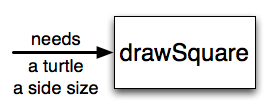

.. Copyright (C)  Brad Miller, David Ranum, Jeffrey Elkner, Peter Wentworth, Allen B. Downey, Chris
    Meyers, and Dario Mitchell. Permission is granted to copy, distribute
    and/or modify this document under the terms of the GNU Free Documentation
    License, Version 1.3 or any later version published by the Free Software
    Foundation; with Invariant Sections being Forward, Prefaces, and
    Contributor List, no Front-Cover Texts, and no Back-Cover Texts. A copy of
    the license is included in the section entitled "GNU Free Documentation
    License".

5.1 Functions
=============

In Python, a **function** is a named sequence of statements that belong together. 
Their primary purpose is to help us organize programs into chunks that match how we think about the solution to the problem.

For instance, in the last chapter we discovered a way to create a square with a turtle using just three lines of code. 
This solution to the problem of how to make a square is something we may want to reuse. 
For example, if we have a program that creates many squares, instead of typing those three lines over and over again 
every time we want to draw a square, we could instead call a function named ``draw_square`` that contains those three lines of code:

.. code-block:: python

    def draw_square(t):
        for i in range(4):
            t.forward(50)
            t.left(90)

Now we can call this function in our code anytime we wish to draw a square. 
Notice that this function has a parameter ``t``. This parameter represents a turtle. 
Therefore, when we call this function in our code, we need to pass in an argument of a turtle object like so: ``draw_square(alex)``.

You've already been using functions such as ``forward``, ``range``, and ``print`` in your code, 
but now we'll examine how functions work (and how to create your own!) in more detail. 
We'll start by looking at function definitions --- something that every function has, but which you have not yet written yourself.

The syntax for a **function definition** is:

.. code-block:: python

    def name( parameters ):
        statements

You can make up any names you want for the functions you create, except that you can't use a name that is a Python keyword, 
and the names must follow the rules for legal identifiers that were given previously. 
The parameters specify what information, if any, you have to provide in order to use the function. 
Another way to say this is that the parameters specify what the function needs in order to do its work.

There can be any number of statements inside the function, but they have to be indented from the ``def`` line. 
In the examples in this book, we will use the standard indentation of four spaces. 
Function definitions are the second of several **compound statements** we will see, all of which have the same pattern:

#. A **header** line which begins with a keyword and ends with a colon.
#. A **body** consisting of one or more Python statements, each indented the same amount -- *4 spaces is the Python standard* -- from the header line.

We've already seen the ``for`` loop which is also a compound statement and therefore follows this pattern.

In a function definition, the keyword in the header is ``def``, which is followed by the name of the function and some *parameters* enclosed in parentheses. The parameter list may be empty, or it may contain any number of parameters separated from one another by commas. In either case, the parentheses are required.

We need to say a bit more about the parameters. In the definition, the parameter list is more specifically known as the **formal parameters**. This list of names describes those things that the function will need to receive from the user (or "caller") of the function. When you call a function, you provide values to the formal parameters.

The figure below shows this relationship. A function needs certain information to do its work. These values, often called **arguments** or **actual parameters**, are passed to the function by the user.

.. image:: _static/images/blackboxproc.png

This type of diagram is often called a **black-box diagram** because it only states the requirements from the perspective of the user. The user must know the name of the function and what arguments need to be passed. The details of how the function works are hidden inside the "black-box".

Let's return to our turtle example above, where we use a function so we will not have to duplicate all the steps each time we want to make a square.  "Draw a square" can be thought of as an *abstraction* of a number of smaller steps. Let's modify our code so that instead of drawing a square of a set size, we can draw a square of whatever size the user wishes. In order to accomplish this we will need to provide two pieces of information for the function to do its work: a turtle to do the drawing and a size for the sides of the square. We could represent this using the following black-box diagram.

Here is a program containing a function to capture this idea. Give it a try.

    .. raw:: html

        <iframe height="600px" width="100%" src="https://repl.it/@launchcode/Demo-Ch-51a?lite=true" scrolling="no" frameborder="no" allowtransparency="true" allowfullscreen="true" sandbox="allow-forms allow-pointer-lock allow-popups allow-same-origin allow-scripts allow-modals"></iframe>

This function is named ``draw_square``. It has two parameters: one to tell the function which turtle to move around and the other to tell it the size of the square we want drawn. In the function definition they are called ``t`` and ``sz`` respectively. Make sure you know where the body of the function ends --- it depends on the indentation and the blank lines don't count for this purpose!

.. admonition::  docstrings

    If the first thing after the function header is a string (some tools insist that it must be a triple-quoted string), it is called a **docstring** and gets special treatment in Python and in some of the programming tools.

    One way to retrieve the information in this string is to use the interactive interpreter, and enter the expression ``<function_name>.__doc__``, which will retrieve the docstring for the function. So the string you write as documentation at the start of a function is retrievable by Python tools *at runtime*. This is different from comments in your code, which are completely eliminated when the program is parsed.

    By convention, Python programmers use docstrings for the key documentation of their functions.

Defining a new function does not make the function run. To do that we need a **function call**. This is also known as a **function invocation**. We've already seen how to call some built-in functions like ``print``, ``range`` and ``int``. Function calls contain the name of the function to be executed followed by a list of values, called *arguments*, which are assigned to the parameters in the function definition. So in the second to the last line of the program, we call the function, and pass ``alex`` as the turtle to be manipulated, and 50 as the size of the square we want.

Once we've defined a function, we can call it as often as we like and its statements will be executed each time we call it. In this case, we could use it to get one of our turtles to draw a square and then we can move the turtle and have it draw a different square in a different location. Note that we lift the tail so that when ``alex`` moves there is no trace. We put the tail back down before drawing the next square. Make sure you can identify both invocations of the ``draw_square`` function.

    .. raw:: html

        <iframe height="800px" width="100%" src="https://repl.it/@launchcode/Demo-Ch-51b?lite=true" scrolling="no" frameborder="no" allowtransparency="true" allowfullscreen="true" sandbox="allow-forms allow-pointer-lock allow-popups allow-same-origin allow-scripts allow-modals"></iframe>

In the next example, we've made a new function named ``draw_multicolor_square`` that varies from the ``draw_square`` function a little and we get ``tess`` to draw 15 different squares. Once the function has been defined, we can call it as many times as we like with whatever actual parameters we like.

    .. raw:: html

        <iframe height="800px" width="100%" src="https://repl.it/@launchcode/Demo-Ch-51c?lite=true" scrolling="no" frameborder="no" allowtransparency="true" allowfullscreen="true" sandbox="allow-forms allow-pointer-lock allow-popups allow-same-origin allow-scripts allow-modals"></iframe>

**Check your understanding**

See Canvas for review quizes